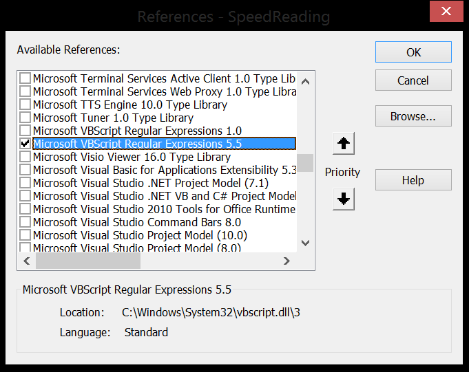
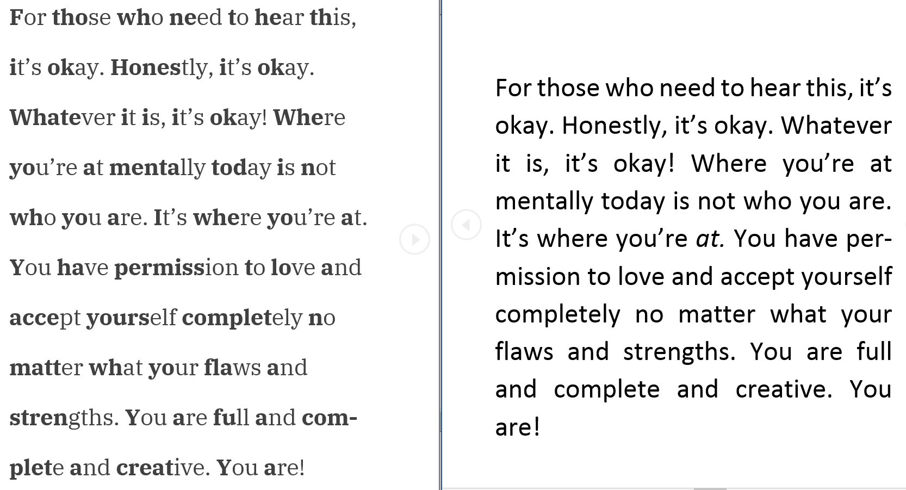

# Table of Contents
- [Speed-Bionic-Reading](#speed-bionic-reading)
  * [Shout out to Bionic-Reading.com](#shout-out-to-bionic-readingcom)
- [Importing the Macro](#importing-the-macro)
  * [Getting the Macro to work](#getting-the-macro-to-work)
  * [Enable Macros](#enable-macros)
- [Recommended Fonts](#recommended-fonts)
- [Output Example](#output-example)
- [Neurodiversity](#neurodiversity)
- [Self Shoutout](#self-shoutout)

===================================

# Speed-Bionic-Reading

Speed reading technique that has recaptured public interest due to Bionic Reading done with a VBA Macro for Word documents.

Speed reading technique is to highlight important words or parts of words in a text so when you review you can quickly absorb the word and move on before your mind needs to read every word in your head slowly. You can understand what you're reading without saying the entire word in your head. 

## Shout out to Bionic-Reading.com

They explain this technique as: 
>Facilitating the reading process by guiding the eyes through text with artificial fixation points. As a result, the reading is only focusing on the highlighted initial letters and lets the brain center complete the word.

# Importing the Macro

The macros are included in a .bas file [here](ImportVBA), when you are in Word press Alt+F11 to open the VB Editor. In VB Editor go to File > Import, or just press Ctrl+M. In the dialog that opens, find and select the .bas file to import your macro.

Alternatively you can just paste the VBA code directly into your module from [here](VBAText). And if you like neat little progress bars, you can find the form and file [here](FormVersion). 

## Getting the Macro to work

The macro relies on Regex, so you must enable the Microsoft VBScript Regular Expressions 5.5 reference.
Press Alt+F11, go to Tools > References > and then Select "Microsoft VBScript Regular Expressions 5.5"

## Enable Macros

If you don't already have macros enabled in your Microsoft office go to:
File > Options > Trust Center > Trust Center Settings > Macro Settings > Then Enable "Trust access to the VBA project object model"

If you're having difficulties, please refer to the [Microsoft Support page](https://support.microsoft.com/en-us/office/macros-in-office-files-12b036fd-d140-4e74-b45e-16fed1a7e5c6) for instructions to enable them. 

# Recommended Fonts

If you really want your document to look like Bionic-Reading, I recommend downloading and installing the IBM Plex Serif font found [here](https://fonts.google.com/specimen/IBM+Plex+Serif). 
I also recommend making the font a slightly lighter shade of black, perhaps 25% lighter.

# Output Example

If reading the left is easier than reading the right, then this is a great tool for you.

# Neurodiversity

There is a lot of talk that this tool is great for neurodivergent people. It definetly can help. It certainly helps me. However, I don't believe it is a solution that will help most. Because this is a speed-reading technique, and a lot of people comprehend better by taking their time. All the bolded letters could make reading more difficult rather than easier for you. 

If this does not work for you, there are other speed reading or focusing techniques. 
I'm not dyslexic, but I found the [OpenDyslexic](https://opendyslexic.org/) font has helped me. 

# Self Shoutout

If you'd like to learn about me, or support me; check out my linktree here: https://linktr.ee/gpfsye! 
You can watch my videos, purchase my book, join me in my Reddit streams, or even buy me a cup of coffee!! All links on the Linktree! 

